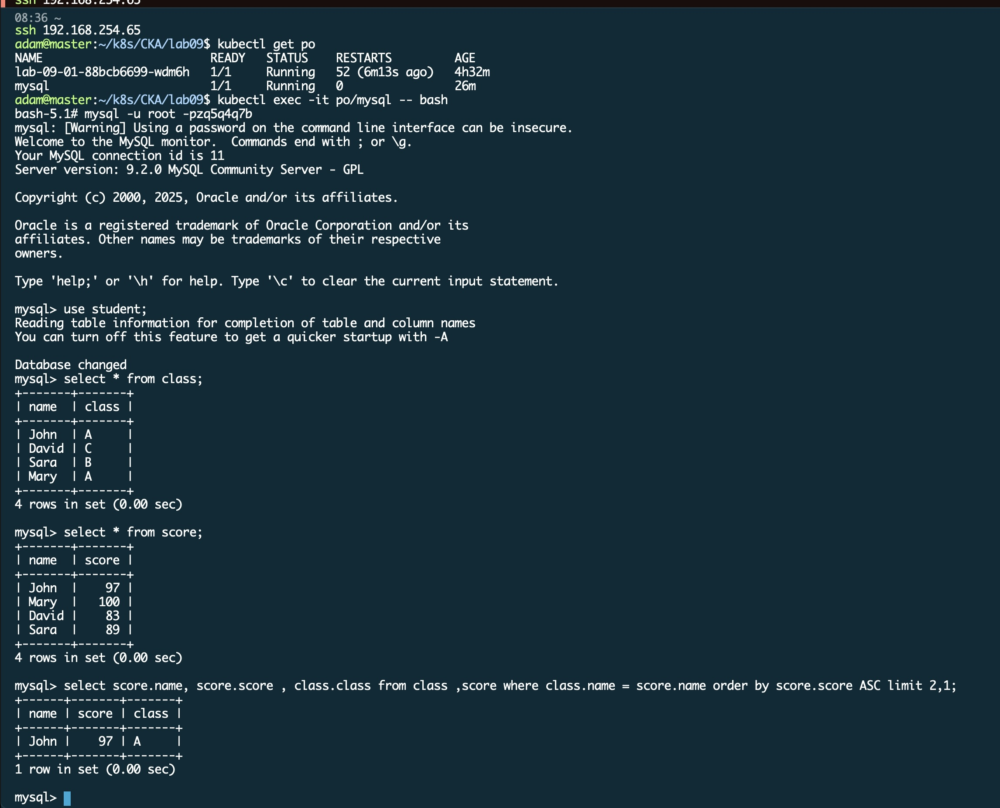

# Session-03
- Mysql sql statement
```sql
CREATE DATABASE student;

USE student;

CREATE TABLE score (
    name varchar(255),
    score int
);

CREATE TABLE class (
    name varchar(255),
    class varchar(1)
);

INSERT INTO score (name, score)
VALUES
    ('John', 97),
    ('Mary', 100),
    ('David',83 ),
    ('Sara', 89);
    

INSERT INTO class (name, class)
VALUES
    ('John', 'A'),
    ('David', 'C'),
    ('Sara', 'B' ),
    ('Mary', 'A');
    
select score.name, score.score , class.class from class ,score where class.name = score.name order by score.score ASC limit 2,1;
```

